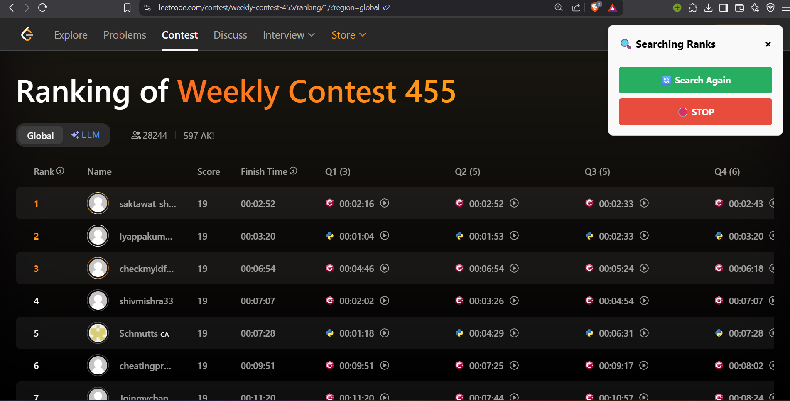

# 🔍 LeetCode Contest Rank Search Extension

A Chrome extension to **automatically find multiple users** in **LeetCode contest rankings**, page by page.

---

## 📦 Features

- 🔎 Enter one or more LeetCode usernames
- 📈 Automatically searches through all ranking pages
- ✅ Shows the page number next to each user when found
- 🔁 Search again easily
- 🛑 Stop the search anytime
- 🧭 Automatically goes to the **first page** before starting

---

## 📸 Preview

Here’s how the extension looks in action:


---

## 📥 Installation (Local)

### 1. Clone or Download

```bash
git clone https://github.com/<your-username>/leetcode-rank-search-extension.git
````

Or download the ZIP and extract it.

### 2. Load into Chrome

1. Open Chrome and go to: `chrome://extensions`
2. Enable **Developer Mode** (top right toggle)
3. Click **Load unpacked**
4. Select the `leetcode-rank-search-extension/` folder

---

## 🧠 How to Use

1. Navigate to a LeetCode contest rank page like:

   ```
   https://leetcode.com/contest/weekly-contest-455/ranking/
   ```

2. Click the extension icon in your toolbar  
3. Click **“Start User Search”**
4. Enter one or more LeetCode usernames (comma-separated)
5. A floating dialog appears showing progress  
6. When users are found, their page numbers are displayed

You can also:
- 🔄 Click **Search Again** to rerun
- 🛑 Click **STOP** to cancel mid-search
- ❌ Click the close button to hide the dialog

---

> 🚨 **Heads Up!**  
> If you see the error:  
> 
> 🧱 **“Rank page not found”**
> 
> It means the extension couldn’t detect the contest ranking table.
> 
> ✅ **Quick Fix:** Just **reload the contest page** and try again.  
> This usually happens because LeetCode loads some content dynamically, and a manual refresh helps the script detect the correct elements.

---


## 🧾 File Structure

```
leetcode-rank-search-extension/
├── manifest.json        # Extension manifest
├── background.js        # (empty placeholder)
├── content.js           # Main user search script (injected)
├── popup.html           # Extension popup UI
├── popup.js             # Sends message to trigger script
├── styles.css           # Optional styling for popup
├── icon16.png           # Toolbar icon
├── icon48.png
└── icon128.png
```

---


## 📜 License

MIT License — free to use and modify.

---

## 🙌 Credits

- Developed by [Akataruka](https://linktr.ee/asutoshk_09)
- Blog for workflow [Leetcode-rank-search-extension development workflow](https://linktr.ee/asutoshk_09)

```
